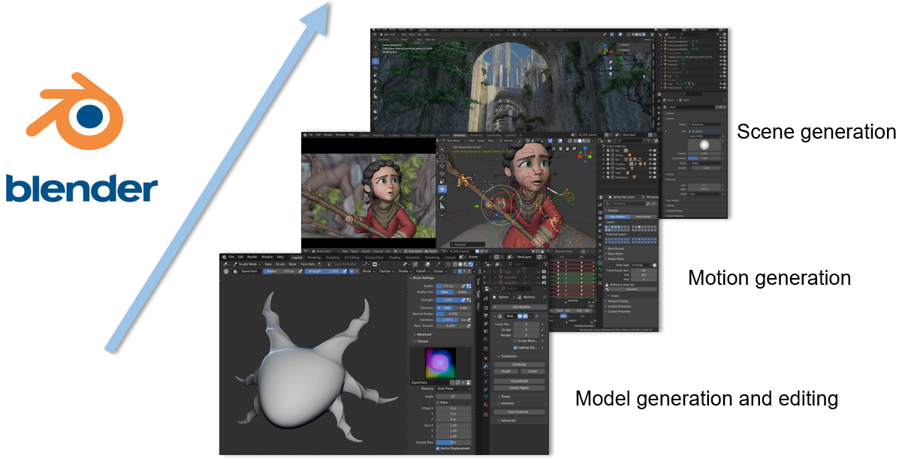

# Al-Assisted Interactive 3D Asset Creation System for Expressive Animation Production

## Group Members

* **Yingjie Xu**: Provides base 3D models according to user needs
* **Xuanchao Peng**: Provides interacted human motion
* **Hengyu Meng:** Edits and Refines the base 3D models
* **Longji** **Huang:** Add scenes and related background suited for 3D models

## Related Source

### Assignment management

* [3D AIGC - Group 15A | Trello](https://trello.com/b/wizu20qT/3d-aigc-group-15a)
* [3D AIGC - User Journey Map | Miro](https://miro.com/welcomeonboard/ZFNCSFVhMVBRZlFDTFRzNEgvMzVOaGV3Vnk4VlNUTWdQN0NyTUM0aDhlUTMxRFhodXB4YzlVSmlLNTk4TUZZcFo4TUNjdFpyVVRCWmFvUVA2REtmWUE5Zmo0cGNEenFlanNQcmR4M0hmMnZvL091RUVRbC9KMVlZSTA3Y011MTNNakdSWkpBejJWRjJhRnhhb1UwcS9BPT0hdjE=?share_link_id=192399432016)

### Datasets

* https://objaverse.allenai.org/
* https://www.mixamo.com/

### Research tools

* [Connected Papers | Find and explore academic papers](https://www.connectedpapers.com/)

